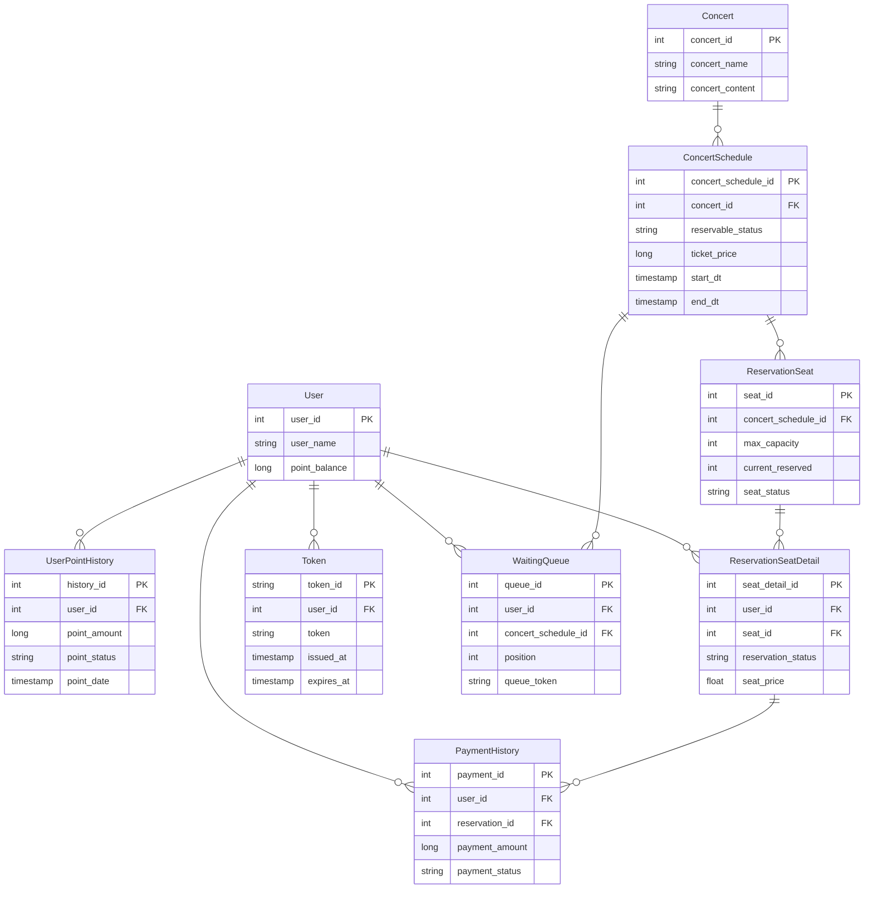

# 콘서트 예약 서비스
* * *
- 
- `콘서트 예약 서비스`를 구현해 봅니다.
- 대기열 시스템을 구축하고, 예약 서비스는 작업가능한 유저만 수행할 수 있도록 해야합니다.
- 사용자는 좌석예약 시에 미리 충전한 잔액을 이용합니다.
- 좌석 예약 요청시에, 결제가 이루어지지 않더라도 일정 시간동안 다른 유저가 해당 좌석에 접근할 수 없도록 합니다.

> ## 프로젝트 아케텍쳐  
>프로젝트 아케텍쳐는 [프로젝트 아키텍쳐 바로가기](./docs/Architecture.md) 에서 확인하실 수 있습니다.

> ## MileStone  
> MileStone 은 <a href="https://github.com/users/Backjinuk/projects/5/views/1">Github Projects</a>에서 확인하실 수 있습니다.

> ## DB락 과 Redis락의 성능 분석록  
> DB락 과 Redis락의 성능 분석록은 <a href="https://velog.io/@backj123/DB%EB%9D%BD%EA%B3%BC-Redis%EB%9D%BD-%EB%B6%84%EC%84%9D%EB%A1%9D">블로그 바로가기</a>에서 확인하실 수 있습니다.  
> 
> Redis에 관한 분석록은 <a href="https://velog.io/@backj123/Redis%EB%A1%9C-%EB%8C%80%EA%B8%B0%EC%97%B4-%EA%B5%AC%ED%98%84%ED%95%98%EA%B8%B0">블로그 바로가기</a>에서 확인하실 수 있습니다.

## 목차
- - -
[1. 요구사항 별 시퀸스 다이어그램](#1-요구사항_별-시퀸스-다이어-그램)

[2. ERD](#2-ERD)

[3. API 명세서](#3-api-명세서--swagger-ui)

[4. 기술스택](#4-기술스택)

* * *
## 1. 요구사항 별 시퀸스 다이어그램/ 클래스 다이어그램
> 요구사항 별 시퀸스 다이어그램은 [여기에서](./docs/SequenceDiagram.md) 확인하실 수 있습니다. 
* * *

## 2. ERD

* * *

## 3. API 명세서 / Swagger Ui
> Swagger Ui 명세서는 [여기에서](./docs/SwaggerUi.md) 확인하실 수 있습니다. 
> 
> API 명세서는 [여기에서](./docs/ApiSpac.md) 확인하실 수 있습니다. 
>
> http 파일은 [여기에서](./src/main/resources/http/Mock-API.http) 확인하실 수 있습니다.
* * *

## 4. 기술스택
### 1. Web Application Server
- Java 17
- Spring Boot
- Spring Web
- Spring Security
- JWT (Json Web Token)
### 2. Database
- H2 (Domain)
- Spring Data JPA
- QueryDSL
### 3. Caching
- Redis (Caching)
### 5. Monitoring System
- Prometheus
### 6. Testing
Spring Boot Test