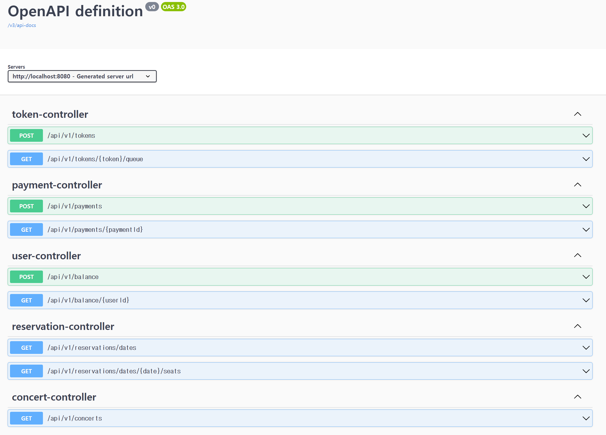

# API Spec

### Open API (Swagger)


## 목차
- [예약 가능 날짜 조회](#예약-가능-날짜-조회)
- [좌석 조회](#좌석-조회)
- [잔액 조회](#잔액-조회)
- [잔액 충전](#잔액-충전)
- [대기열 토큰 발급](#대기열-토큰-발급)
- [좌석 예약](#좌석-예약)
- [예약 결제](#예약-결제)

---

## 예약 가능 날짜 조회

### `GET /api/v1/reservations/dates`

예약 가능한 날짜 목록을 조회합니다.

#### Example Request

```http
GET /api/v1/reservations/dates HTTP/1.1
Host: localhost:8080
```

#### 200 OK

```json
{
  "status": "OK",
  "message": "",
  "data": [
    {
      "date": "2024-10-10",
      "availableSeats": 50
    },
    {
      "date": "2024-10-12",
      "availableSeats": 30
    }
  ]
}
```

#### 500 Internal Server Error

```json
{
  "status": "Internal Server Error",
  "message": "예약 가능한 날짜 조회 중 오류가 발생했습니다."
}
```

---

## 좌석 조회

### `GET /api/v1/reservations/dates/{date}/seats`

특정 날짜의 예약 가능한 좌석을 조회합니다.

#### Example Request

```http
GET /api/v1/reservations/dates/2024-10-10/seats HTTP/1.1
Host: localhost:8080
```

#### 200 OK

```json
{
  "status": "OK",
  "message": "",
  "data": [
    {
      "seatDetailId": 1,
      "userId": 0,
      "seatId": 1,
      "seatCode": "A1",
      "reservationStatus": "AVAILABLE",
      "seatPrice": 10000
    },
    {
      "seatDetailId": 2,
      "userId": 0,
      "seatId": 2,
      "seatCode": "A2",
      "reservationStatus": "AVAILABLE",
      "seatPrice": 10000
    }
  ]
}
```

#### 404 Not Found

```json
{
  "status": "Not Found",
  "message": "해당 날짜에 예약 가능한 좌석이 없습니다."
}
```

---

## 잔액 조회

### `GET /api/v1/balance/{userId}`

사용자의 잔액을 조회합니다.

#### Example Request

```http
GET /api/v1/balance/1 HTTP/1.1
Host: localhost:8080
```

#### 200 OK

```json
{
  "status": "OK",
  "message": "",
  "data": {
    "userId": 1,
    "pointBalance": 15000,
    "userName": "향해 테스트"
  }
}
```

#### 404 Not Found

```json
{
  "status": "Not Found",
  "message": "사용자를 찾을 수 없습니다."
}
```

---

## 잔액 충전

### `POST /api/v1/balance`

사용자의 잔액을 충전합니다.

#### Example Request

```http
POST /api/v1/balance HTTP/1.1
Host: localhost:8080
Content-Type: application/json

{
  "userId": 1,
  "pointAmount": 5000
}
```

#### 200 OK

```json
{
  "status": "OK",
  "message": "",
  "data": {
    "userId": 1,
    "pointBalance": 20000,
    "userName": "향해 테스트"
  }
}
```

#### 400 Bad Request

```json
{
  "status": "Bad Request",
  "message": "잘못된 요청 (예: 유효하지 않은 사용자 ID 또는 충전 금액)"
}
```

---

## 대기열 토큰 발급

### `POST /api/v1/tokens`

서비스 이용을 위해 대기열 토큰을 발급받습니다.

#### Example Request

```http
POST /api/v1/tokens HTTP/1.1
Host: localhost:8080
Content-Type: application/json

{
  "userId": 1
}
```

#### 201 Created

```json
{
  "status": "Created",
  "data": {
    "tokenId": 10,
    "userId": 1,
    "token": "550e8400-e29b-41d4-a716-446655440000",
    "issuedAt": "2024-10-10T10:00:00",
    "expiresAt": "2024-10-10T10:05:00"
  }
}
```

---

## 좌석 예약

### `POST /api/v1/reservations`

좌석을 예약합니다.

#### Example Request

```http
POST /api/v1/reservations HTTP/1.1
Host: localhost:8080
Content-Type: application/json

{
  "seatId": 1,
  "userId": 1
}
```

#### 201 Created

```json
{
  "status": "Created",
  "data": {
    "reservationId": 10,
    "seatId": 1,
    "userId": 1,
    "reservationStatus": "TEMP_ASSIGNED"
  }
}
```

---

## 예약 결제

### `POST /api/v1/payments`

좌석 예약에 대한 결제를 처리합니다.

#### Example Request

```http
POST /api/v1/payments HTTP/1.1
Host: localhost:8080
Content-Type: application/json

{
  "userId": 1,
  "reservationId": 2,
  "paymentAmount": 10000
}
```

#### 200 OK

```json
{
  "status": "OK",
  "message": "",
  "data": {
    "paymentId": 10,
    "userId": 1,
    "reservationId": 2,
    "paymentStatus": "COMPLETED"
  }
}
```
