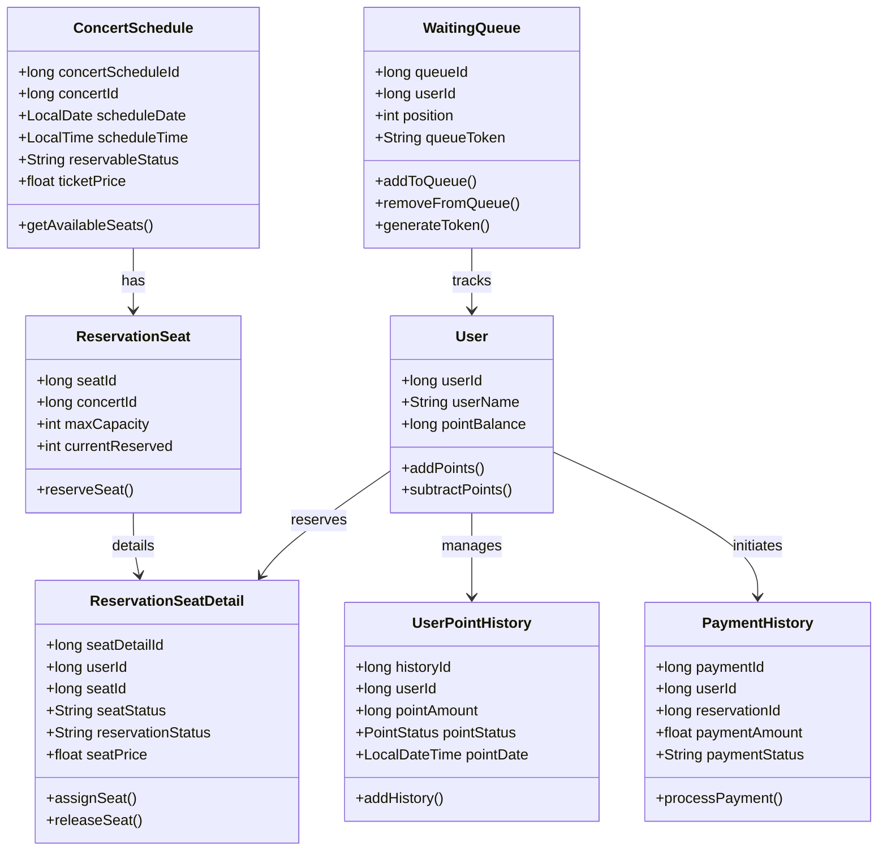

## Class Diagram

### User (사용자):
- userId, userName, pointBalance 등의 속성을 가짐
- 사용자의 포인트를 추가하거나 차감하는 addPoints(), subtractPoints() 메서드를 제공함.

### UserPointHistory (포인트 히스토리):
- historyId, userId, pointAmount, pointStatus, pointDate와 같은 속성을 가짐
- 사용자의 포인트 기록을 추가하는 addHistory() 메서드를 제공함.

### ConcertSchedule (콘서트 스케줄):
- concertScheduleId, concertId, scheduleDate, scheduleTime, reservableStatus, ticketPrice 등의 속성을 가짐
- 예약 가능한 좌석을 조회하는 getAvailableSeats() 메서드를 제공함.

### ReservationSeat (예약 좌석):
- seatId, concertId, maxCapacity, currentReserved 등의 속성을 가짐
- 좌석을 예약하는 reserveSeat() 메서드를 제공함.

### ReservationSeatDetail (좌석 상세 정보):
- seatDetailId, userId, seatId, seatStatus, reservationStatus, seatPrice 속성을 가짐
- 좌석을 사용자에게 할당하거나 해제하는 assignSeat(), releaseSeat() 메서드를 제공함.
- 
### PaymentHistory (결제 히스토리):
- paymentId, userId, reservationId, paymentAmount, paymentStatus 속성을 가짐
- 결제를 처리하는 processPayment() 메서드를 제공함.

### WaitingQueue (대기열):
- queueId, userId, position, queueToken 등의 속성을 가짐
- 유저를 대기열에 추가하거나 제거하고, 토큰을 생성하는 addToQueue(), removeFromQueue(), generateToken() 메서드를 제공함.