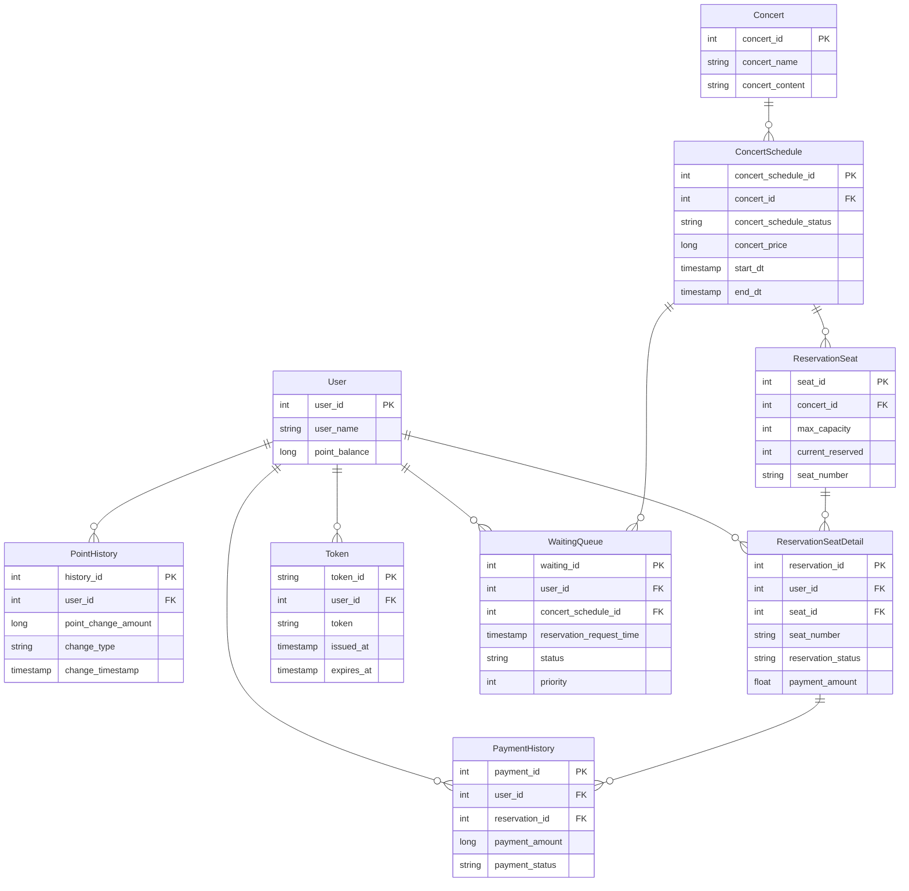

```mermaid
erDiagram
    User {
        int user_id PK
        string user_name
        long point_balance
    }

    PointHistory {
        int history_id PK
        int user_id FK
        long point_change_amount
        string change_type
        timestamp change_timestamp
    }

    PaymentHistory {
        int payment_id PK
        int user_id FK
        int reservation_id FK
        long payment_amount
        string payment_status
    }

    ReservationSeat {
        int seat_id PK
        int concert_id FK
        int max_capacity
        int current_reserved
        string seat_number
    }

    ReservationSeatDetail {
        int reservation_id PK
        int user_id FK
        int seat_id FK
        string seat_number
        string reservation_status
        float payment_amount
    }

    Concert {
        int concert_id PK
        string concert_name
        string concert_content
    }

    ConcertSchedule {
        int concert_schedule_id PK
        int concert_id FK
        string concert_schedule_status
        long concert_price
        timestamp start_dt
        timestamp end_dt
    }

    Token {
        string token_id PK
        int user_id FK
        string token
        timestamp issued_at
        timestamp expires_at
    }

    WaitingQueue {
        int waiting_id PK
        int user_id FK
        int concert_schedule_id FK
        timestamp reservation_request_time
        string status
        int priority
    }

    User ||--o{ PointHistory : ""
    User ||--o{ PaymentHistory : ""
    User ||--o{ ReservationSeatDetail : ""
    User ||--o{ WaitingQueue : ""
    User ||--o{ Token : ""

    Concert ||--o{ ConcertSchedule : ""
    ConcertSchedule ||--o{ ReservationSeat : ""
    ConcertSchedule ||--o{ WaitingQueue : ""

    ReservationSeat ||--o{ ReservationSeatDetail : ""
    ReservationSeatDetail ||--o{ PaymentHistory : ""

```