## Swagger Ui

전체 Swagger Ui

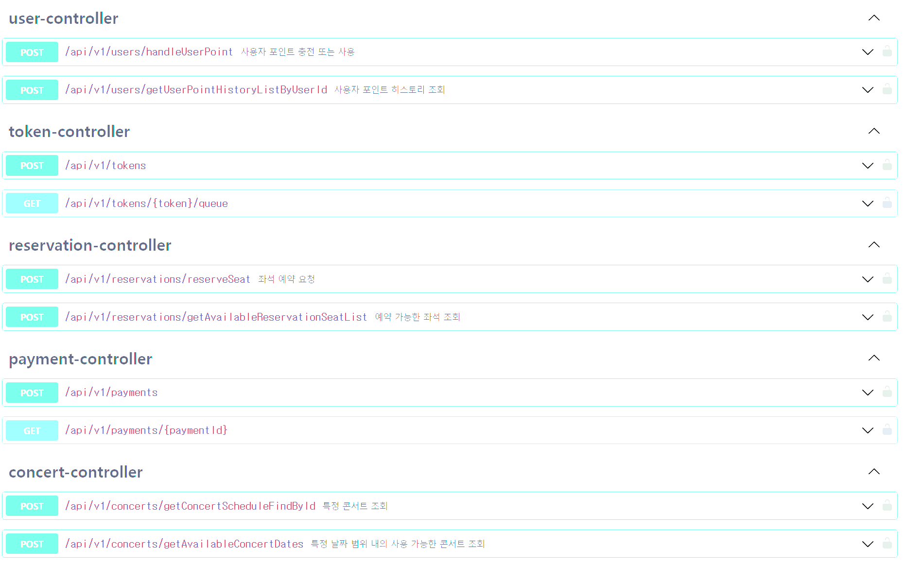

## user

사용자 포인트 충전 또는 사용 API

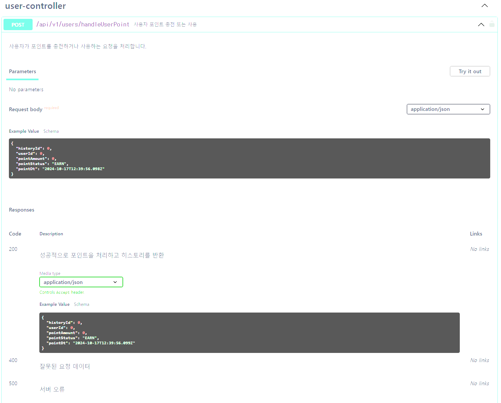

사용자 포인트 히스토리 조회

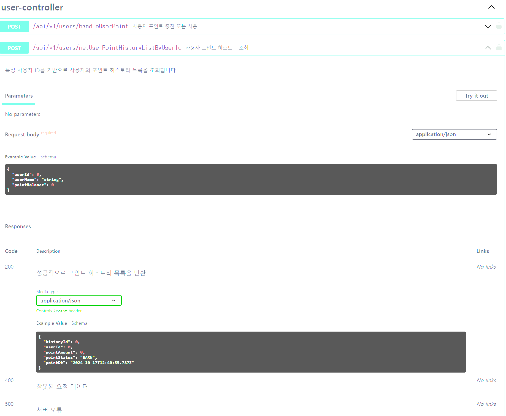

## token

사용자 토큰 빌드 api

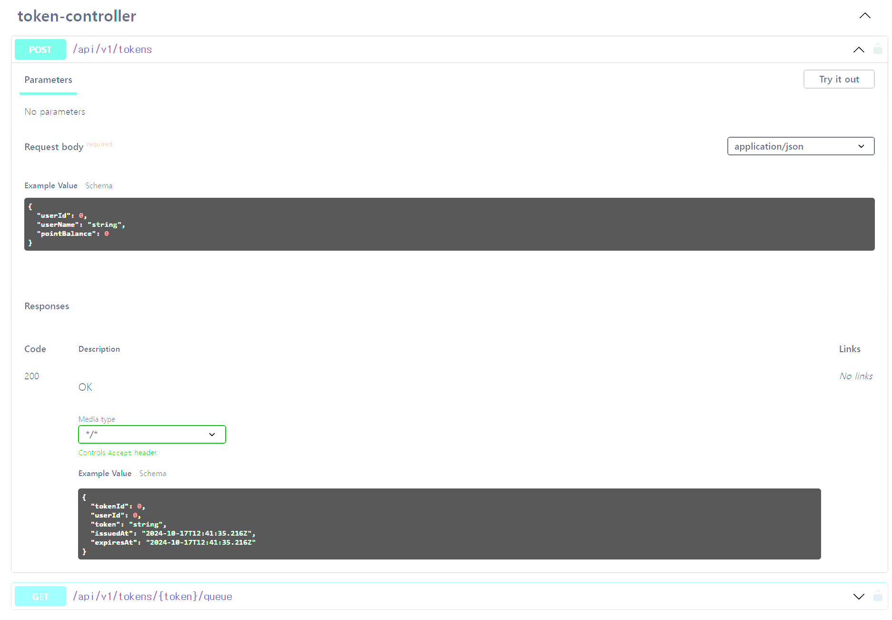

사용자 토큰 조회

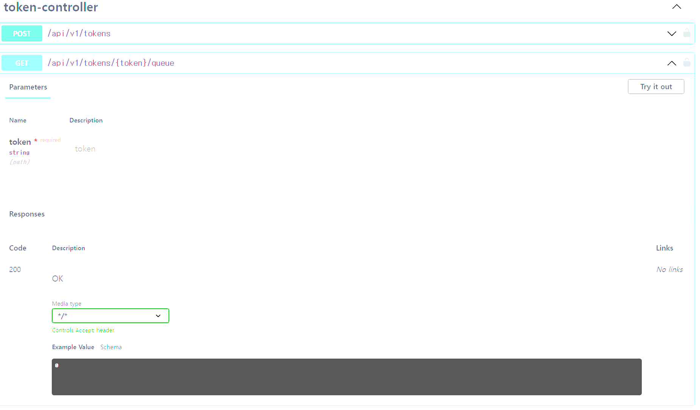

## ReservationSeat Api

예약 가능한 좌석 조회

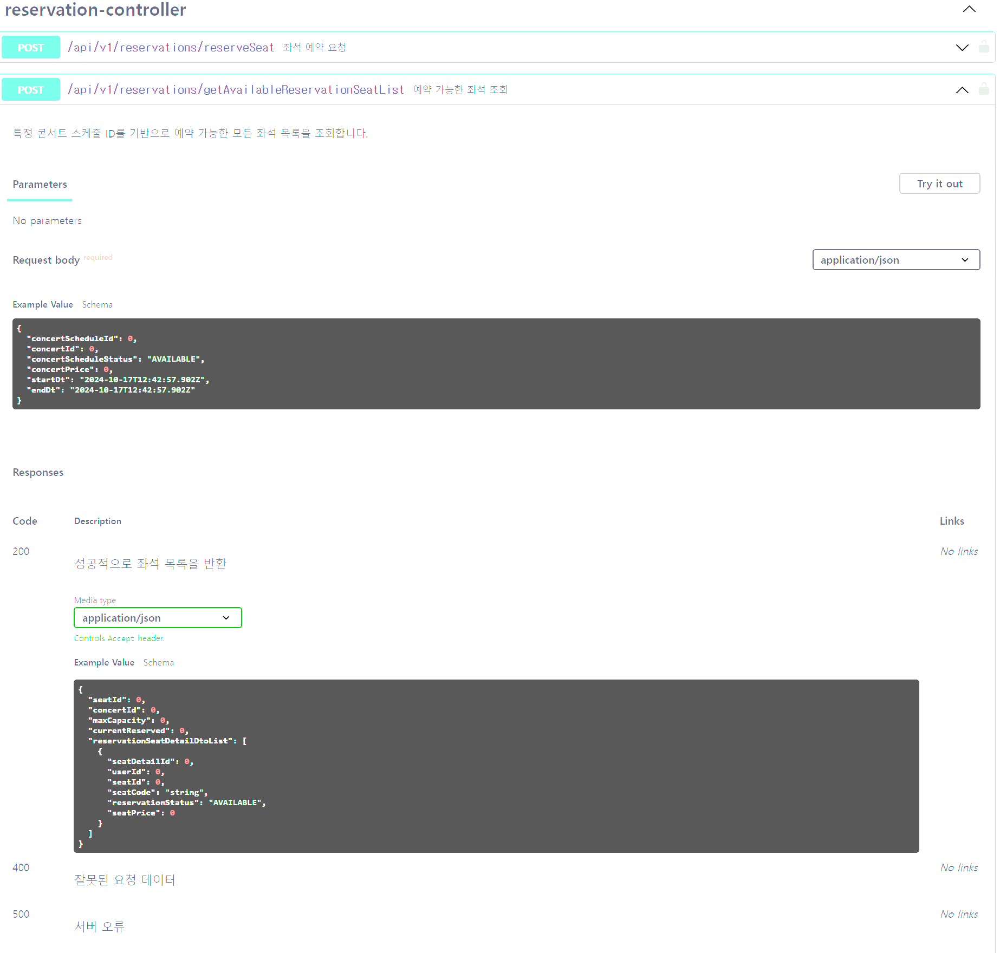

예약 가능한 좌석 예약 요청

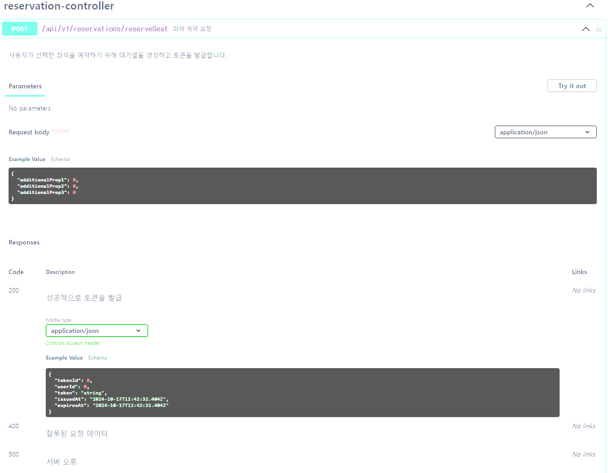

## Payment API

결제 요청 api

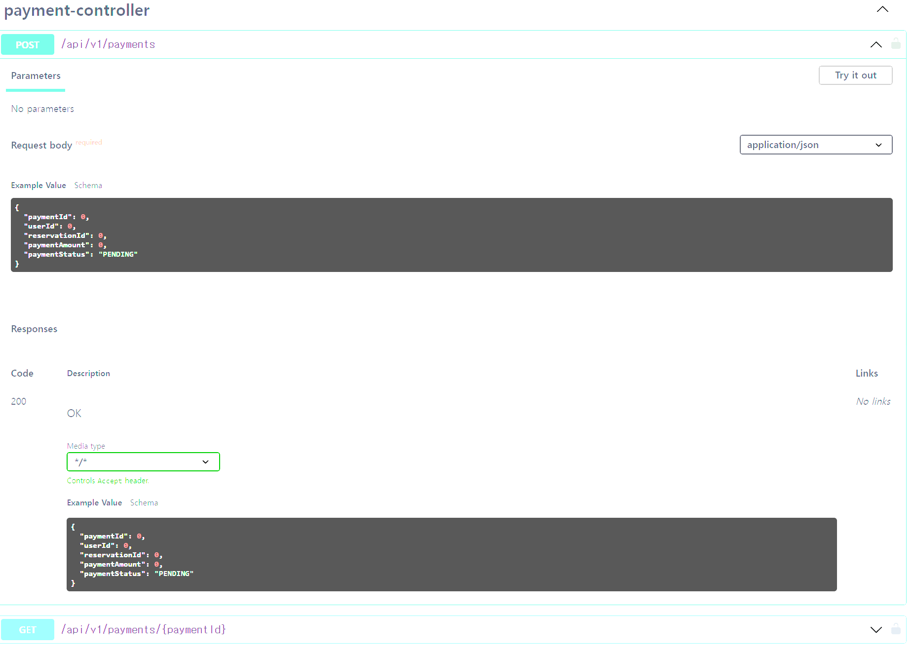

사용자별 결제 히스토리 조회 요청 

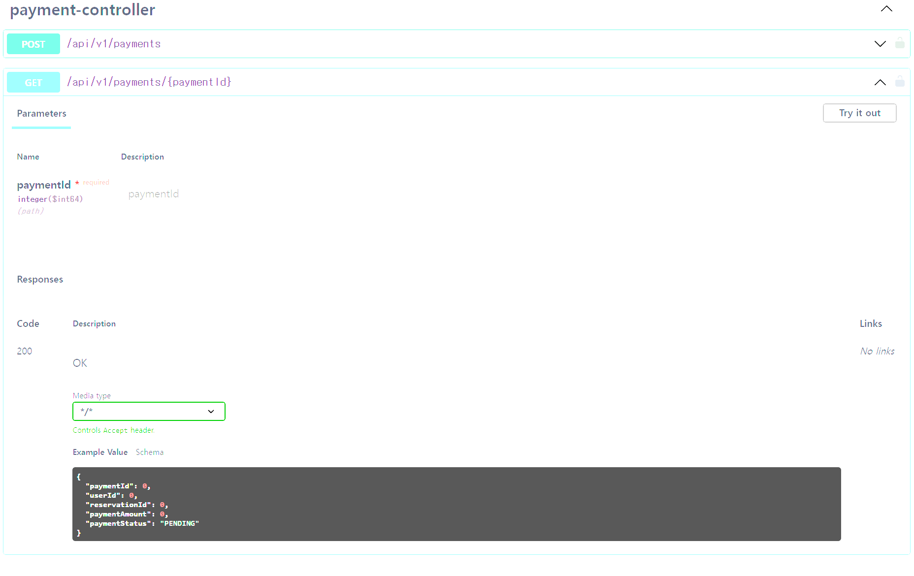

## Concert

특정 콘서트의 세부 콘서트 목록 조회

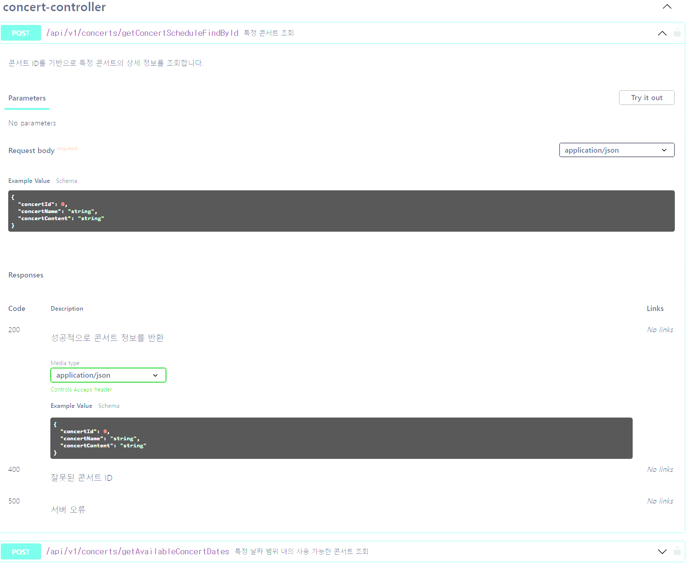

날짜 기반으로 콘서트 목록 조회

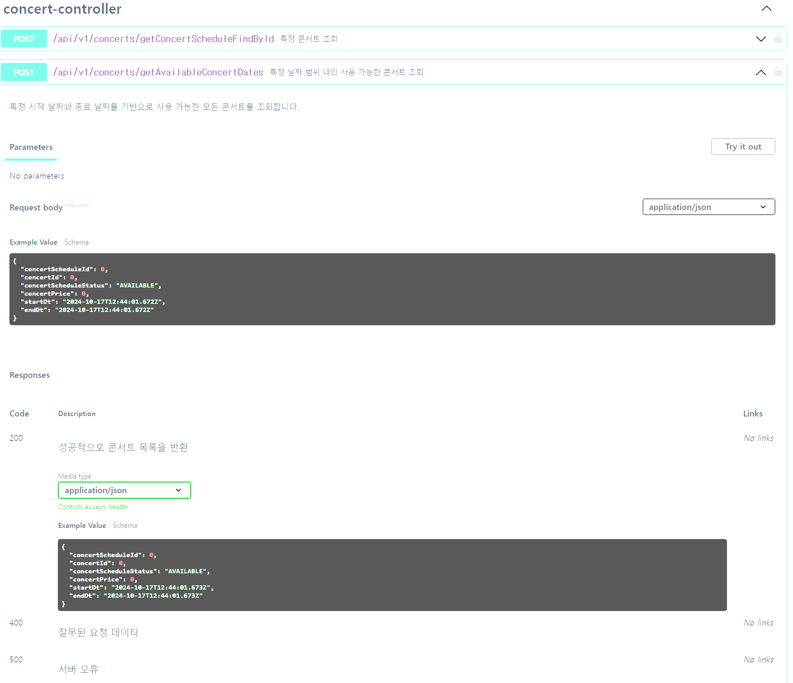

